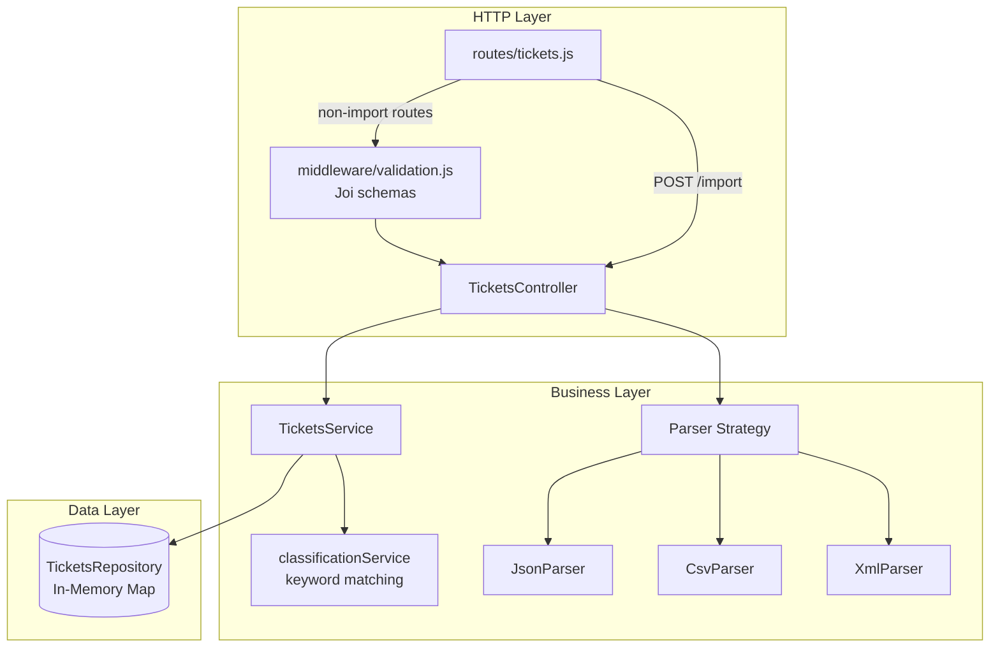
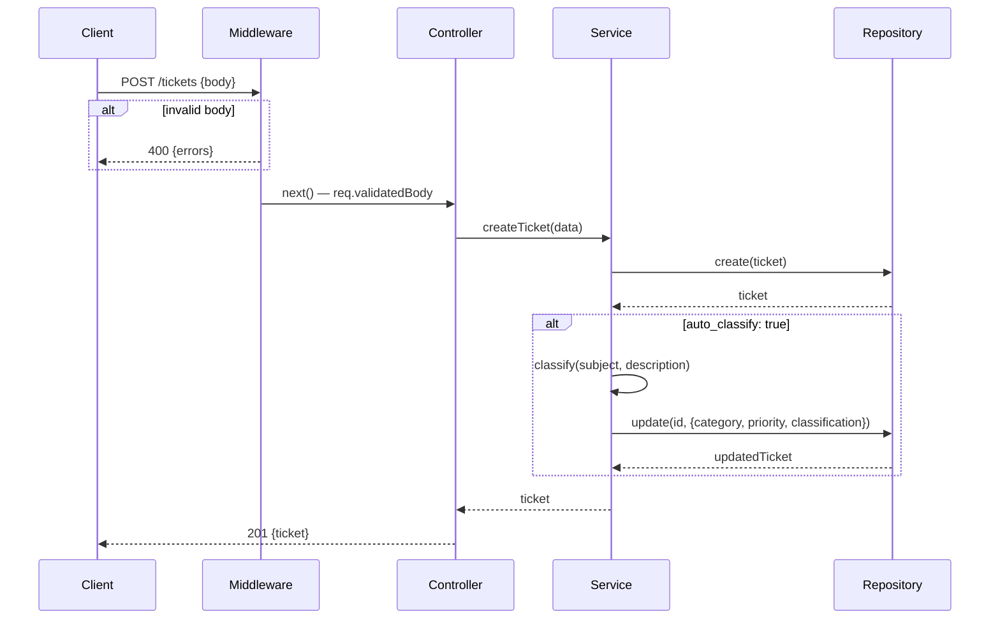
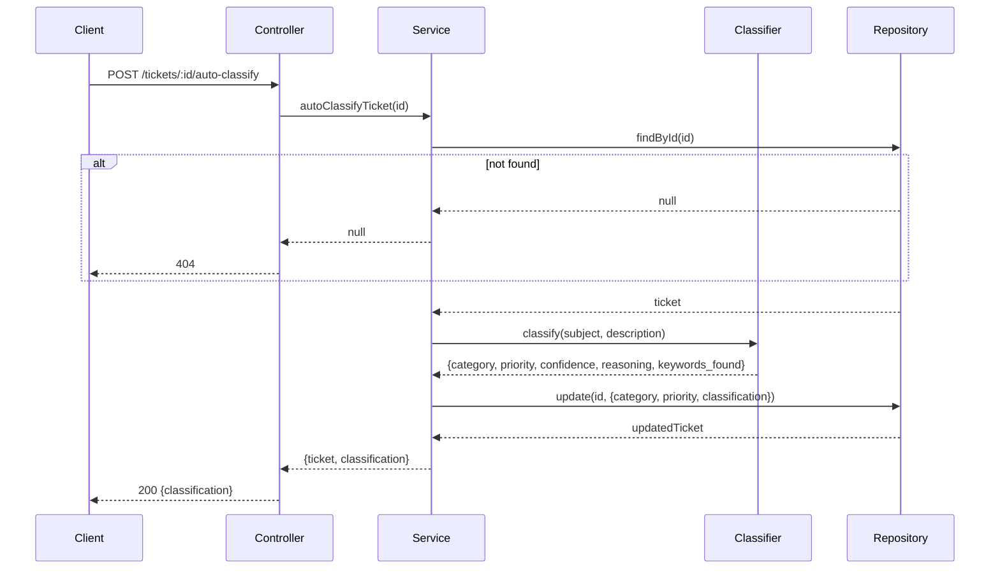
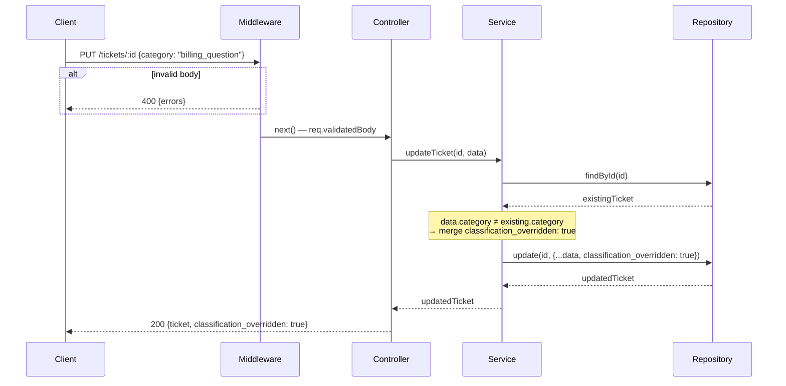

# Architecture

## Overview

The Support Ticket API is a layered Express application with strict separation of concerns. All state lives in an in-memory `Map` — there is no external database.

---

## Components

### routes/tickets.js

Declares all seven routes. Applies `validateCreate` / `validateUpdate` Joi middleware before every mutating route except `POST /import`, which skips middleware and validates each record individually inside the service.

### middleware/validation.js

Two middleware functions (`validateCreate`, `validateUpdate`). Each runs Joi against `req.body`, returns `400` with an `errors` array on failure, and writes the coerced value to `req.validatedBody` on success.

### TicketsController

Thin HTTP adapter. Reads from `req.params`, `req.query`, and `req.validatedBody`; delegates entirely to `TicketsService`; maps return values to HTTP status codes. Contains no business logic.

### TicketsService

All business logic lives here.

| Method | Responsibility |
|--------|---------------|
| `createTicket(data)` | Strips `auto_classify`, builds the ticket, persists it, then optionally calls `_applyClassification` |
| `autoClassifyTicket(id)` | Public entry point for `POST /tickets/:id/auto-classify` |
| `_applyClassification(id, ticket)` | Calls `classify()`, logs the result, writes `category`, `priority`, and `classification` metadata directly to the repository — bypasses `updateTicket` to avoid false override detection |
| `updateTicket(id, data)` | Detects manual `category`/`priority` changes; sets `classification_overridden: true` when either differs from the stored value |
| `importTickets(records)` | Validates each record against `createSchema` individually; reports per-record errors without aborting the batch |

### classificationService

Stateless exported function `classify(subject, description)`. Scores each category by counting keyword matches in the combined text; picks the highest-scoring category (defaults to `other`). Priority is determined by the first matching priority-keyword group in order: urgent → high → low → medium. Returns `{ category, priority, confidence, reasoning, keywords_found }`.

### Parser Strategy

`parserStrategy.parse(contentType, body)` maps the `Content-Type` header to one of three parser classes. Unsupported types throw, which the controller catches and returns as `400`.

| Content-Type | Parser | Notes |
|---|---|---|
| `application/json` | `JsonParser` | Accepts pre-parsed array or JSON string |
| `text/csv` | `CsvParser` | Flattens `metadata_*` columns; splits pipe-delimited tags |
| `application/xml` / `text/xml` | `XmlParser` | Async `xml2js`; normalises `explicitArray` output |

### TicketsRepository

Wraps a `Map<id, ticket>`. Provides `create`, `findAll` (equality filter on `status`, `category`, `priority`, `customer_id`, `assigned_to`), `findById`, `update`, `remove`, and `clear` (used in tests). Exported as a singleton.

---

## Data Flow

### Ticket Creation

### Auto-Classify Endpoint

### Manual Override Detection

---

## Design Decisions

### In-memory storage

All tickets are held in a `Map`. This removes operational complexity (no database to provision, migrate, or connect to) and keeps the focus on API design patterns. The trade-off is that state is lost on restart and horizontal scaling is not supported.

### Singleton exports

`TicketsRepository`, `TicketsService`, and `TicketsController` are each exported as `new ClassName()`. This avoids the need for dependency injection at this scale. Jest's module cache gives each test file its own fresh instance.

### Import bypasses request validation

`POST /tickets/import` does not go through the Joi middleware. Validation runs per-record inside `TicketsService.importTickets` so a single bad record never aborts the batch. The response always reports `total_records`, `successful`, and a `failed` array with per-record error details.

### `_applyClassification` writes directly to the repository

`_applyClassification` calls `repository.update` rather than `this.updateTicket`. This prevents the override-detection logic in `updateTicket` from firing on a system-driven update and incorrectly setting `classification_overridden: true`.

### Conditional Joi schema for `auto_classify`

`category` and `priority` use `Joi.when('auto_classify', ...)` to be mutually exclusive with the `auto_classify` flag. Providing both returns `400` at the validation layer, keeping the controller and service free of that guard.

---

## Security Considerations

- Input is validated with Joi before reaching any business logic. Enum fields reject arbitrary strings.
- No authentication or rate limiting is implemented — this is intentional for a course project.
- The only external libraries that parse untrusted input are `xml2js` (XML import) and `csv-parse` (CSV import), both well-maintained.

## Performance Considerations

- Reads and writes to the `Map` are O(1); `findAll` with filters is O(n). With large ticket counts, per-field index maps would bring filter scans to O(1) at the cost of write complexity.
- Classification is pure synchronous string matching — negligible CPU cost.
- XML parsing (`xml2js.parseStringPromise`) is async to avoid blocking the event loop on large payloads.
