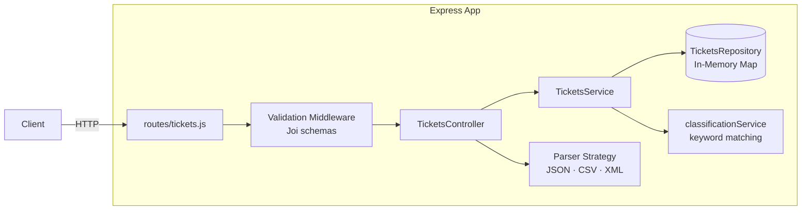

# Support Ticket API

A RESTful Express API for managing customer support tickets with keyword-based automatic classification, batch import, and in-memory storage.

## Features

- Full CRUD for support tickets
- Keyword-based automatic classification of category and priority
- Optional `auto_classify` flag on ticket creation
- Batch import via JSON, CSV, or XML (partial-success reporting)
- Filter tickets by status, category, priority, customer, or assignee
- Classification audit trail stored on each ticket
- Manual override detection with `classification_overridden` flag

## Architecture



## Quick Start

```bash
npm install
npm start          # http://localhost:3000
```

See [HOWTORUN.md](HOWTORUN.md) for full setup and test-running instructions.

## Documentation

| File | Audience |
|------|----------|
| [HOWTORUN.md](HOWTORUN.md) | Anyone running the project locally |
| [API_REFERENCE.md](API_REFERENCE.md) | API consumers |
| [ARCHITECTURE.md](ARCHITECTURE.md) | Contributors and reviewers |
| [TESTING_GUIDE.md](TESTING_GUIDE.md) | Contributors writing or running tests |

## Project Structure

```
src/
├── app.js                              Express setup + body parsers
├── server.js                           HTTP entry point
├── routes/tickets.js                   Route definitions
├── controllers/ticketsController.js    Thin HTTP layer
├── middleware/validation.js            Joi validation middleware
├── schemas/ticketSchema.js             Joi schemas + enum constants
├── services/
│   ├── ticketsService.js               Business logic
│   ├── classificationService.js        Keyword-based classifier
│   └── parsers/
│       ├── parserStrategy.js           Content-Type router
│       ├── jsonParser.js               JSON array parser
│       ├── csvParser.js                CSV (pipe tags, flat metadata_*)
│       └── xmlParser.js               XML (async xml2js)
└── repositories/
    └── ticketsRepository.js            In-memory Map store

tests/
├── fixtures/                           Sample and invalid-record fixtures
├── test_ticket_api.test.js             HTTP endpoint tests
├── test_ticket_model.test.js           Joi schema validation tests
├── test_import_csv.test.js             CsvParser unit tests
├── test_import_json.test.js            JsonParser unit tests
├── test_import_xml.test.js             XmlParser unit tests
├── test_categorization.test.js         classificationService unit tests
├── test_integration.test.js            Integration tests (requires live server)
├── test_e2e.test.js                    E2E tests (requires live server)
└── test_performance.test.js            Performance benchmarks (requires live server)
```

## Environment Variables

| Variable | Default | Description |
|----------|---------|-------------|
| `PORT` | `3000` | HTTP port the server listens on |
| `API_URL` | `http://localhost:3000` | Target URL used by live-server test suites |
