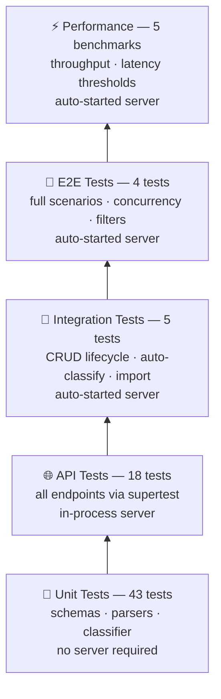

# Testing Guide

## Test Pyramid



The bottom two tiers run under `npm test`. The top three require a live HTTP server and each has a dedicated npm script that manages the server lifecycle automatically.

---

## Commands

| Command | What it runs | Server needed |
|---------|-------------|---------------|
| `npm test` | Unit + API tests with coverage | No |
| `npm run test:watch` | Unit + API tests in watch mode | No |
| `npm run test:integr` | Integration tests | Auto-started |
| `npm run test:e2e` | E2E tests | Auto-started |
| `npm run test:perf` | Performance benchmarks | Auto-started |

The live-server commands use `start-server-and-test`: they start the API, wait for `GET /tickets` to return 200, run the suite, then stop the server.

---

## Test Files

| File | Covers |
|------|--------|
| `test_ticket_api.test.js` | All HTTP endpoints — status codes, request/response shapes, filter params, error cases |
| `test_ticket_model.test.js` | Joi `createSchema` / `updateSchema` — enum values, required fields, `auto_classify` mutual exclusivity |
| `test_import_csv.test.js` | `CsvParser` — pipe-delimited tags, `metadata_*` column flattening, null coercion |
| `test_import_json.test.js` | `JsonParser` — pre-parsed array, JSON string input, error cases |
| `test_import_xml.test.js` | `XmlParser` — single/multi ticket, `<tags><tag>` normalisation, parse errors |
| `test_categorization.test.js` | `classify()` — all categories, all priorities, confidence scoring, `keywords_found` |
| `test_integration.test.js` | Full CRUD lifecycle, auto-classify on creation, batch import, override detection |
| `test_e2e.test.js` | Complete lifecycle, bulk import + parallel auto-classify, 25 concurrent creates, combined filters |
| `test_performance.test.js` | Import 100 records, list, filter, 20× auto-classify on create, 10× sequential classify |

---

## Jest Configs

Each live-server suite has its own Jest config so it is not affected by the `testPathIgnorePatterns` in `package.json`:

| Config file | Used by |
|-------------|---------|
| _(package.json)_ | `npm test` — excludes all live-server files |
| `jest.integr.config.js` | `npm run test:integr` |
| `jest.e2e.config.js` | `npm run test:e2e` |
| `jest.perf.config.js` | `npm run test:perf` |

---

## Test Isolation

Unit and API tests use `beforeEach(() => repository.clear())` to reset in-memory state between cases.

Integration and E2E tests run against a shared live server with no reset between tests. Isolation is achieved by:

- **CRUD / lifecycle tests** — operate on specific IDs returned by `POST /tickets`; assertions use `toContain` / `not.toContain` against the ID, not list length.
- **Batch / concurrent tests** — stamp each ticket with a unique `assigned_to` value derived from `Date.now()`, then filter all list queries with `?assigned_to=<runId>` so counts are scoped to the current test run.
- **Filter tests** — same `assigned_to` isolation; all filter queries include `&assigned_to=<runId>`.

---

## Fixture Files

`tests/fixtures/` contains two sets of files:

### Valid fixtures (used by unit tests)

| File | Contents |
|------|----------|
| `tickets.json` | 2-record JSON array |
| `tickets.csv` | 2-record CSV (pipe-separated tags, `metadata_*` columns) |
| `tickets.xml` | 2-record XML (`<tags><tag>` structure) |

### Invalid fixtures (used for negative-path tests)

| File | Invalid records |
|------|----------------|
| `invalid_tickets.json` | 8 records: 1 valid + bad email, missing email, bad category, bad priority, bad status, bad metadata source, missing customer_id |
| `invalid_tickets.csv` | 8 records: same failure modes (status and source variants differ slightly) |
| `invalid_tickets.xml` | 7 records: 1 valid + bad email, missing email, bad category, bad priority, bad metadata source, missing customer_id |

CSV column order:
```
customer_id, customer_email, customer_name, subject, description,
category, priority, status, tags, assigned_to, resolved_at,
metadata_source, metadata_browser, metadata_device_type
```

XML root element must be `<tickets>` with `<ticket>` children. Tags go under `<tags><tag>…</tag></tags>`.

---

## Coverage

`npm test` collects coverage from `src/**/*.js`. Current thresholds are informational only (no enforcement). To check:

```bash
npm test
# Coverage summary printed at the end
```

---

## Performance Benchmarks

Run via `npm run test:perf`. All thresholds are measured on loopback (no network latency).

| Benchmark | Threshold |
|-----------|-----------|
| Batch import — 100 records via `POST /tickets/import` | < 3 000 ms |
| List all — `GET /tickets` | < 500 ms |
| Filtered list — `GET /tickets?category=technical_issue` | < 500 ms |
| 20 × `POST /tickets` with `auto_classify: true` (parallel) | < 5 000 ms |
| 10 × `POST /tickets/:id/auto-classify` (sequential) | < 3 000 ms |
