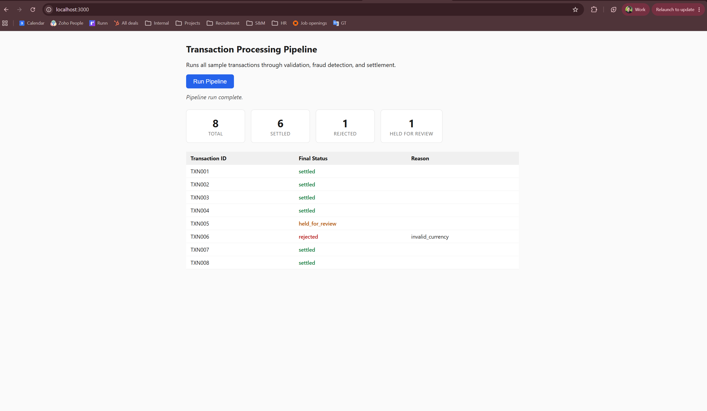
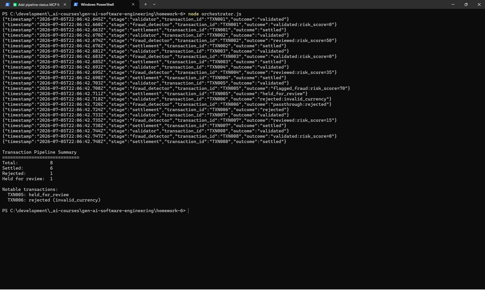
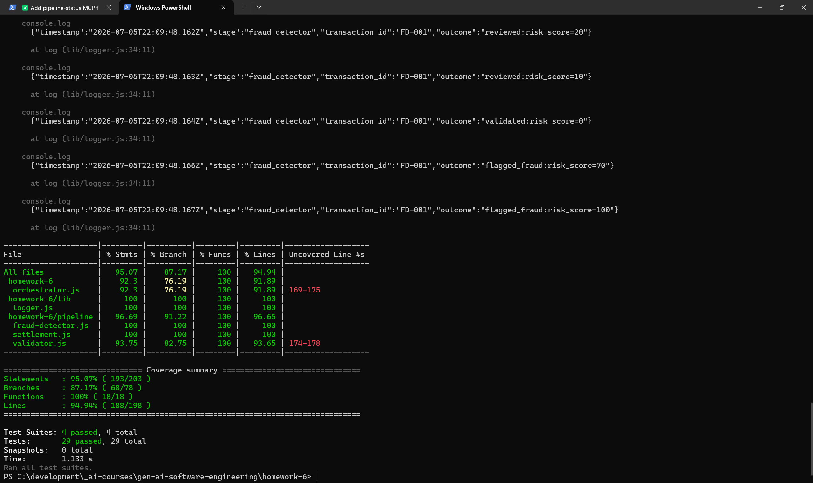

<!-- _class: lead -->

# 🔗 Transaction Processing Pipeline

**Student Name**: Yevhen Kulinichenko AAI02
**Date Submitted**: 06.07.2026
**AI Tools Used**: Claude Code

*A file-based, three-stage Node.js transaction pipeline*
**validation → fraud detection → settlement**

---

## 🎯 Problem / Objective

> Build a Node.js/Express-compatible, file-based transaction processing
> pipeline that validates, fraud-scores, and settles the transactions in
> `sample-transactions.json` in sequence (validator → fraud detector →
> settlement), orchestrated end-to-end and reported on in `shared/results/`.

<span class="badge">SOURCE</span> `specification.md` — High-Level Objective

---

## 🏗️ Architecture

<style scoped>
pre { font-size: 0.48em; line-height: 1.2; padding: 0.5em 1.2em; }
</style>

```
              sample-transactions.json
                        |
                        v
     orchestrator.js  (ensures shared/{input,processing,output,results}/,
                        drives every record through the 3 stages below)
                        |
                        v
        +---------------------------------------------+
        | validator.js - fields, decimal amount,       |
        | ISO 4217 currency, refund sign rule          |
        +---------------------------------------------+
                        |
                        v
        +---------------------------------------------+
        | fraud-detector.js - 0-100 risk score ->      |
        | validated / reviewed / flagged_fraud         |
        +---------------------------------------------+
                        |
                        v
        +---------------------------------------------+
        | settlement.js - -> settled / rejected /      |
        | held_for_review                              |
        +---------------------------------------------+
                        |
                        v
          shared/results/<id>.json + summary.json
                        |
              +---------+---------+
              v                   v
       Express front-end      MCP server
       frontend/server.js     mcp/server.js
       npm run frontend       pipeline-status
       -> :3000                (get_transaction_status,
                                 list_pipeline_results)
```

---

<!-- _class: lead -->

## Pipeline Stages 🧩

Three sequential stages, each a pure function over a JSON envelope

---

## 1️⃣ Validator — `pipeline/validator.js`

Checks required fields, parses `amount` with `decimal.js` (never
`Number`/`parseFloat`), validates currency against an ISO 4217 allow-list
(`USD`, `EUR`, `GBP`, `JPY`), and enforces the refund sign rule.

<div class="cols">
<div class="box">

**❌ TXN006** — currency `"XYZ"`, $200 transfer
Rejected: `invalid_currency` — not on the allow-list.

</div>
<div class="box">

**✅ TXN007** — refund, `amount: "-100.00"`
Normalized via `Decimal.abs()` → `"100.00"`, marked `validated`.

</div>
</div>

---

## 2️⃣ Fraud Detector — `pipeline/fraud-detector.js`

<style scoped>
p, li { font-size: 0.9em; }
table { font-size: 0.82em; }
th, td { padding: 0.3em 0.7em; }
</style>

Sums five weighted risk factors (0–100, capped) against every non-rejected transaction:

| Factor | Condition | Weight |
|---|---|---|
| `high_value` | amount > $10k | +40 |
| `very_high_value` | amount > $50k | +20 |
| `unusual_timing` | 00:00–06:00 UTC | +20 |
| `cross_border` | `metadata.country !== "US"` | +15 |
| `wire_transfer` | transfer method | +10 |

**Score ≥ 60** → `flagged_fraud` · **> 0** → `reviewed` · **else** → `validated`

---

## 🚩 Fraud Scoring Example

> **TXN005** — $75,000 wire transfer, US, 10:00 UTC
> `high_value` (+40) + `very_high_value` (+20) + `wire_transfer` (+10) = **70**
> → `flagged_fraud`

*Design note: TXN002 scores exactly 50 by the same literal formula —
`reviewed`, not flagged — resolving an ambiguity between the spec's prose
and its own worked arithmetic in favor of the arithmetic.*

---

## 3️⃣ Settlement — `pipeline/settlement.js`

Turns the fraud detector's `status` into a `final_status`:

- 🔴 `rejected` **stays** `rejected` (reason preserved)
- 🟡 `flagged_fraud` **becomes** `held_for_review` (never auto-settled)
- 🟢 `validated` / `reviewed` **becomes** `settled` (+ `settled_at` timestamp)

> **TXN001** — $1,500 USD transfer, US, business hours → scores 0 →
> `validated` → `settled`, written to `shared/results/TXN001.json`

---

## 🤖 The Four-Agent Workflow

| # | Agent | Role |
|---|---|---|
| 1 | `spec-writer` | Writes `specification.md` before any code |
| 2 | `pipeline-codegen` | Builds `orchestrator.js`, `pipeline/*.js`, `frontend/`; uses context7 |
| 3 | `unit-test-writer` | Jest suite + coverage gate (80% threshold) |
| 4 | `docs-writer` | README, HOWTORUN, PR description, this deck |

Defined in `.claude/agents/*.md`, each with a scoped `tools:` allow-list —
no agent invents requirements outside `specification.md`/`TASKS.md`.

---

## 🔌 MCP Integration

**context7** — used by `pipeline-codegen` before non-trivial library usage.

> "Decimal constructor invalid string error handling, isNaN, abs(),
> greaterThan comparison" → resolved to `/mikemcl/decimal.js` → confirmed
> `new Decimal('abc')` *throws* rather than returning `NaN`.

**Custom `pipeline-status` server** (`mcp/server.js`, built on `@modelcontextprotocol/sdk`):
- 🔧 `get_transaction_status` — look up one transaction's final record
- 🔧 `list_pipeline_results` — aggregate counts across all results
- 📄 `pipeline://summary` — raw `shared/results/summary.json`

---

## ⚙️ Skills & Hooks

- **`/run-pipeline`** — clears `shared/{input,processing,output,results}/`,
  runs `node orchestrator.js`, renders results as markdown tables
- **`/validate-transactions`** — read-only dry-run validation, no `shared/` writes
- **🛑 Coverage-gate hook** (`PreToolUse` → `scripts/check-coverage.js`) —
  blocks `git push` when line coverage is below **80%**

---

## 🎬 Demo

<style scoped>
.box p { margin: 0.25em 0; font-size: 0.88em; }
.box img { display: block; margin: 0.5em auto 0; border-radius: 4px; }
</style>

<div class="cols">
<div class="box">

**Express front-end**
`npm run frontend` → `:3000`
Triggers a fresh run, renders summary + per-transaction table in-browser



</div>
<div class="box">

**CLI pipeline run**
`npm run pipeline`
Prints a human-readable summary with counts per transaction outcome



</div>
</div>

---

## ✅ Test Coverage

<style scoped>
table { font-size: 0.85em; }
th, td { padding: 0.25em 0.7em; }
p { margin: 0.4em 0; font-size: 0.9em; }
p img { display: block; margin: 0.3em auto 0; border-radius: 4px; }
</style>

| Metric | Coverage |
|---|---|
| Statements | 95.07% (193/203) |
| Branches | 87.17% (68/78) |
| Functions | 100% (18/18) |
| **Lines** | **94.94% (188/198)** |

**29 tests · 4 suites · all passing** — well above the 80% coverage-gate threshold.



---

<!-- _class: lead -->

## 📚 Lessons Learned

- **`decimal.js` beats native `Number`** — but *throws* on unparseable
  input instead of returning `NaN`; context7 caught this before it crashed
- **File-based message passing** makes every hand-off inspectable on disk,
  at the cost of extra I/O
- **Spec ambiguity must be resolved in code, not silently**
- **Scoped subagent tool allow-lists** kept each agent honest about its job

---

<!-- _class: lead -->

# Thank you 🙌

Questions welcome
